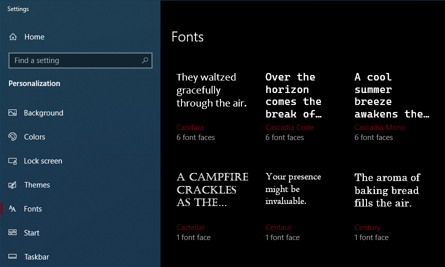

# Yoinking Cascadia Code from wherever Windows Terminal was hiding it

I really wanted Cascadia inside IntelliJ IDEA because I HATE their default font.

So I _thought_ i could just switch it to Cascadia since it was already installed by Windows terminal... right?

WRONG.

So let the games begin. I start punching some Questions into DuckDuckGo.

### Search Attempt 0

Q: cascaidia code font not showing as option in intellij idea

A: "Configuring colors and fonts in IntelliJ IDEA. jetbrains.com/help"

Nope, I know how to do that, I'm looking for a missing font.

## The hunt

### Search Attempt 0.1

Windows Settings > Personalization > Fonts

Sooooo... it's installed. But where?



I'm out of ideas.  To the internet!

### Search Attempt 0.2

Q: where is "cascadia code" stored location disk

A: "I have no idea what you just asked, but here's the cascadia-code repository"

Ok, this is where we diverge from "the fastest way to the solution" to
"what is actually going on here."

I know the easy way out is just to "insall" the fonts globally from the package.
I'm interested now in why I can't access the seeminly already installed font that I'm already using in Windows Terminal and VSCode.

Back to the internet.

### Search Attempt 1

Q: Windows? Fonts?

A: `Win+R`, type `fonts`, press Enter.

Cascadia Code is NOT in C:\Windows\Fonts.

So uh... where the hell is it?

### Search Attempt 2

Q: What OTHER locations does windows install fonts

A: [Try here:](https://answers.microsoft.com/en-us/windows/forum/windows_10-files/windows-10-fonts-folder/40616542-c0a4-417a-838e-3eab4294d825?auth=1) `C:\Users\You\AppData\Local\Micrsoft\Fonts`

Nope. Empty.

### Search Attempt 3

Q: Windows Single User Fonts

A: [Windows Docsss](https://docs.microsoft.com/en-us/typography/fonts/windows_10_font_list)

This sent me down a more useless path.

All the information here was about how fonts themselves work and are made.

I also popped another search into the Docs site about Fonts

I somehow got to this [weird developer page](https://docs.microsoft.com/en-us/windows/win32/gdi/font-embedding-functions) about embedding fonts in applications that use the Windows Graphics Device Interface???

Bro I'm just trying to find the font.

### Search Attempt 4

Remember that github link from earlier.  Lets search the Issues for Cascadia!

Q: Cascadia

A: 73 Open issues, 523 Closed

Uhhhh. That's a lot.  I just started popping open some relevant issues but it was slow going.

This [issue](https://github.com/microsoft/terminal/issues/9375) got me sniffing down the right trail.

The bottom has a [resolution](https://github.com/microsoft/terminal/issues/9375#issuecomment-819674657) commit listed.

The [commit](https://github.com/microsoft/terminal/pull/9734/files) actaully has quite a bit of changes to scroll through.

But at the bottom I find [this](https://github.com/microsoft/terminal/pull/9734/files#diff-887813b45e41c02689b09e9e599047335cbc2cd3eb2b38604cf645977ee0fd99R863) comment in the code.

> // - Digs through the directory that the current executable is running within to find
> //   any TTF files sitting next to it.

So what I'm hearing is that the .ttf file might be wherever the windows terminal executable is!

### Search Attempt 5

Q: Where are windows store apps located

A: Apparantly in a folder called `WindowsApps`

The local users version of this at `C:\Users\You\AppData\Local\Microsoft\WindowsApps` did have the `wt.exe` shortcut, and a Windows Terminal folder, but no sign of any other _stuff_. 
Seems like this was for binaries only.

The global version at `C:\Program Files\WindowsApps` told me "You need administrator access to open this folder", followed by "You can't just use administrator access, you need to change the actual permissions on the folder to even see this."

So instead, i just opened a Admin Powershell term and `ls`ed the contents.

And whatdaya know, all of the windows store apps are in there.  Even old versions of the same apps.  Very cluttered.

So i quickly fire `wt --version` to make sure I open the right folder but after I figure it out I do:

```ps
ls 'C:\Program Files\WindowsApps\Microsoft.WindowsTerminal_1.7.1033.0_x64__8wekyb3d8bbwe\'


    Directory: C:\Program Files\WindowsApps\Microsoft.WindowsTerminal_1.7.1033.0_x64__8wekyb3d8bbwe


Mode                 LastWriteTime         Length Name
----                 -------------         ------ ----
d-----         4/16/2021  11:59 AM                AppxMetadata
d-----         4/16/2021  11:59 AM                Images
d-----         4/16/2021  11:59 AM                Microsoft.Terminal.Settings.Editor
d-----         4/16/2021  11:59 AM                Microsoft.Terminal.TerminalControl
d-----         4/16/2021  11:59 AM                Microsoft.UI.Xaml
d-----         4/16/2021  11:59 AM                ProfileIcons
d-----         4/16/2021  11:59 AM                TerminalApp
-a----         4/16/2021  11:59 AM          70038 AppxBlockMap.xml
-a----         4/16/2021  11:59 AM          34468 AppxManifest.xml
-a----         4/16/2021  11:59 AM          11035 AppxSignature.p7x
-a----         4/16/2021  11:59 AM            358 BuildInfo.xml
-a----         3/11/2021  11:38 PM         378812 Cascadia.ttf
-a----         3/11/2021  11:38 PM         362220 CascadiaMono.ttf
-a----         4/16/2021  11:59 AM         309120 concrt140.dll
-a----         3/11/2021  11:38 PM          49152 concrt140_app.dll
-a----        12/15/2019   9:24 AM        1072640 cpprest142_2_10.dll
-a----         4/16/2021  11:59 AM          16956 defaults.json
-a----         4/16/2021  11:59 AM         113152 Microsoft.Terminal.Remoting.dll
-a----         4/16/2021  11:59 AM           7168 Microsoft.Terminal.Remoting.winmd
-a----         4/16/2021  11:59 AM        1296384 Microsoft.Terminal.Settings.Editor.dll
-a----         4/16/2021  11:59 AM          43008 Microsoft.Terminal.Settings.Editor.winmd
-a----         4/16/2021  11:59 AM         926720 Microsoft.Terminal.Settings.Model.dll
-a----         4/16/2021  11:59 AM          62976 Microsoft.Terminal.Settings.Model.winmd
-a----         4/16/2021  11:59 AM           5632 Microsoft.Terminal.TerminalConnection.winmd
-a----         4/16/2021  11:59 AM          23552 Microsoft.Terminal.TerminalControl.winmd
-a----         3/11/2021  11:38 PM         109600 Microsoft.Toolkit.Win32.UI.XamlHost.dll
-a----         3/11/2021  11:38 PM          11808 Microsoft.Toolkit.Win32.UI.XamlHost.winmd
-a----         3/11/2021  11:38 PM        5371272 Microsoft.UI.Xaml.dll
-a----         3/11/2021  11:38 PM         374664 Microsoft.UI.Xaml.winmd
-a----         4/16/2021  11:59 AM         564112 msvcp140.dll
-a----         4/16/2021  11:59 AM          23952 msvcp140_1.dll
-a----         3/11/2021  11:38 PM          10240 msvcp140_1_app.dll
-a----         4/16/2021  11:59 AM         185744 msvcp140_2.dll
-a----         3/11/2021  11:38 PM          12288 msvcp140_2_app.dll
-a----         3/11/2021  11:38 PM         250880 msvcp140_app.dll
-a----         4/16/2021  11:59 AM          41360 msvcp140_atomic_wait.dll
-a----         4/16/2021  11:59 AM          20368 msvcp140_codecvt_ids.dll
-a----         3/11/2021  11:38 PM          11373 NOTICE.html
-a----         4/16/2021  11:59 AM        1050624 OpenConsole.exe
-a----         4/16/2021  11:59 AM        7285128 resources.pri
-a----         4/16/2021  11:59 AM        2573312 TerminalApp.dll
-a----         4/16/2021  11:59 AM          45568 TerminalApp.winmd
-a----         4/16/2021  11:59 AM          60928 TerminalAzBridge.exe
-a----         4/16/2021  11:59 AM         445440 TerminalConnection.dll
-a----         4/16/2021  11:59 AM        1021952 TerminalControl.dll
-a----         4/23/2020  10:28 AM          14848 TerminalThemeHelpers.dll
-a----         3/11/2021  11:38 PM          37888 vcamp140_app.dll
-a----         4/16/2021  11:59 AM         331152 vccorlib140.dll
-a----         3/11/2021  11:38 PM          41984 vccorlib140_app.dll
-a----         3/11/2021  11:38 PM          16384 vcomp140_app.dll
-a----         4/16/2021  11:59 AM          96144 vcruntime140.dll
-a----         4/16/2021  11:59 AM          36752 vcruntime140_1.dll
-a----         3/11/2021  11:38 PM           9728 vcruntime140_1_app.dll
-a----         3/11/2021  11:38 PM          13824 vcruntime140_app.dll
-a----         4/16/2021  11:59 AM         304640 WindowsTerminal.exe
-a----         4/16/2021  11:59 AM          74752 WindowsTerminalShellExt.dll
-a----         4/16/2021  11:59 AM          92672 wt.exe

```

And look... There she is, that beauty `CascadiaMono.ttf`.

So I fire off a cp to grab them out of there

```ps
cp 'C:\Program Files\WindowsApps\Microsoft.WindowsTerminal_1.7.1033.0_x64__8wekyb3d8bbwe\Cascadia*' 'G:\Temp\'
```

## The next step

Earlier I had found out that there are registry entries for all fonts

`Computer\HKEY_LOCAL_MACHINE\SOFTWARE\Microsoft\Windows NT\CurrentVersion\Fonts`

It was not listed there.

HOWEVER

after going back after I did the whole ordeal I found out that it WAS in

`Computer\HKEY_CURRENT_USER\SOFTWARE\Microsoft\Windows NT\CurrentVersion\Fonts\Microsoft.WindowsTerminal_1.7.1033.0_x64__8wekyb3d8bbwe`

The data values here point to the file location that the fonts are stored.

So if it is installed, and registered... Why the heck can IntelliJ not see it???  
Maybe IntelliJ is just dumb?

Lets see if there are any other programs that can change fonts, but not find Cascadia.

* Notepad: found it
* Word: found it
* DrRacket: found it

So uhh. I should file a report to IntelliJ for this?

Found [the issue here](https://youtrack.jetbrains.com/issue/JBR-3134)

Basically has to do with the way Java/JVM interacts with Windows fonts.

Workaroudn is put the ttf file directly in IDEA's fonts folder

`C:\Program Files\JetBrains\IntelliJ IDEA 2021.1\jbr\lib\fonts`

another `cp` and a restart of IDEA and my work here is DONEZO.

(Now, if ony IntelliJ also registered it's fonts with Windows when it installed :hmm:)

## Update

I need this update, because, well... updates.

IntelliJ makes a new folder for itself with each update.  ie. `IntelliJ IDEA 2021.2`.

When this happens our old fonts are lost to time (they're just in the old version's folder).

So we get to do this whole song and dance all over again!  🎉
